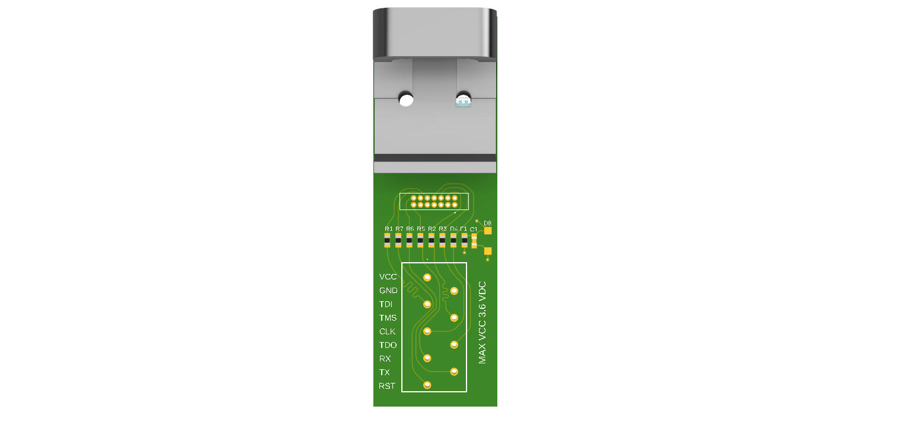
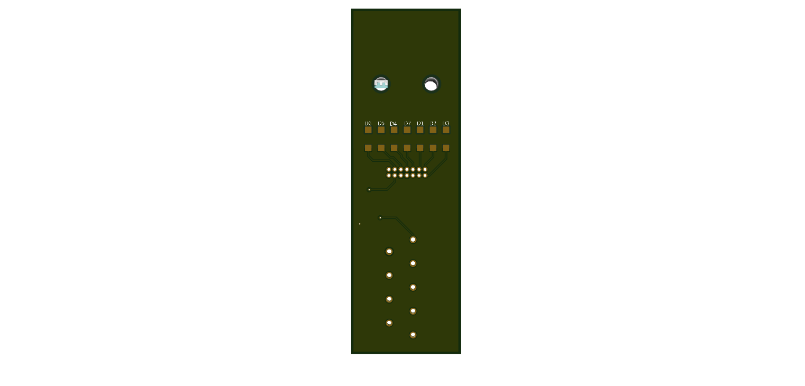

# STLINK_V3_MINIE_Adapter  
*DIN-rail mountable adapter with ESD protection and industrial-grade terminal blocks for STLINK-V3MINIE*

A robust, industrial-grade adapter for securely mounting the **STLINK-V3MINIE** programmer/debugger on a standard 35 mm DIN rail.  
It features built-in ESD protection and spring-loaded terminal blocks for fast, reliable connections. Designed for use in development labs, test stations, and industrial environments.

---

## 🔧 Description

This adapter provides secure, tool-less wiring for the STLINK-V3MINIE using industrial-grade push-in spring terminal blocks (Phoenix PTSA 0.5).  
It includes onboard ESD protection for enhanced device safety and signal integrity.

### Key Features

- ✅ **Integrated ESD Protection** – Protects signal lines against electrostatic discharge, improving reliability during development and testing.  
- ✅ **Phoenix PTSA 0.5 Terminal Blocks** – High-quality spring-loaded terminals enable quick and reliable wire connections (SWD, UART, power).  
- ✅ **DIN Rail Mounting** – Compatible with standard 35 mm DIN rails. Ideal for lab setups, production lines, or industrial enclosures.  
- ✅ **Designed for STLINK-V3MINIE** – Fully compatible with ST's compact and cost-effective STM32 debugger/programmer.  
- ✅ **Professional Compact Design** – Space-efficient PCB layout for easy integration into demanding environments.

---

## ⚙️ Use Cases

- Embedded STM32 programming and debugging in industrial environments  
- Automated production line device testing (ICT, EOL, etc.)  
- Electronics R&D and diagnostics with enhanced durability

---

## 🛠️ PCB Manufacturing

All design files, including schematics, Gerber files, and BOM, are located in the `Electronic Design` directory.  
PCBs can be ordered from JLCPCB or any preferred manufacturer.  

It is recommended to purchase components from trusted distributors such as Mouser, Farnell, Digi-Key, or TME.  
All schematic symbols and footprints were sourced from Mouser’s official library or product pages.

---

## 🧾 Bill of Materials

The full BOM is included in the `Electronic Design` package.

### DIN Rail Mount Clips

- ITALTRONIC 2× [07.6010000](https://www.italtronic.com/en/products/din-rail-supports/07-6010000)  
- ITALTRONIC 1× [07.6000000](https://www.italtronic.com/en/products/din-rail-supports/07-6000000)

---

## 🖼️ Images

Top and bottom views of the assembled adapter:

  

---

## 🤝 Contributions

Contributions, issues, and suggestions are welcome!  
Feel free to open an issue or submit a pull request if you find a bug or want to improve the project.

---

## 🔗 Links

- 🔧 [Official STLINK-V3MINIE Product Page – STMicroelectronics](https://www.st.com/en/development-tools/stlink-v3minie.html)  
  Detailed product info, datasheet, and technical documentation.

- 📄 [STLINK-V3MINIE User Manual (UM2910)](https://www.st.com/resource/en/user_manual/um2910-stlinkv3minie-evaluation-board-stmicroelectronics.pdf)  
  Full user guide with hardware description, pinout, and usage instructions.

- 📥 [STM32CubeProgrammer (ST’s official programming software)](https://www.st.com/en/development-tools/stm32cubeprog.html)  
  Software to flash and debug STM32 microcontrollers using STLINK.

- 💾 [STLINK USB Drivers for Windows](https://www.st.com/en/development-tools/stsw-link009.html)  
  Required drivers for using STLINK on Windows systems.

- 💡 [ST Community Forum – STLINK topics](https://community.st.com/s/topic/0TO0X000000BSqLWAW/stlink)  
  Discussions, troubleshooting, and tips shared by developers.

---

## 📜 License

This project is licensed under the MIT License. See the [LICENSE](./LICENSE) file for details.
